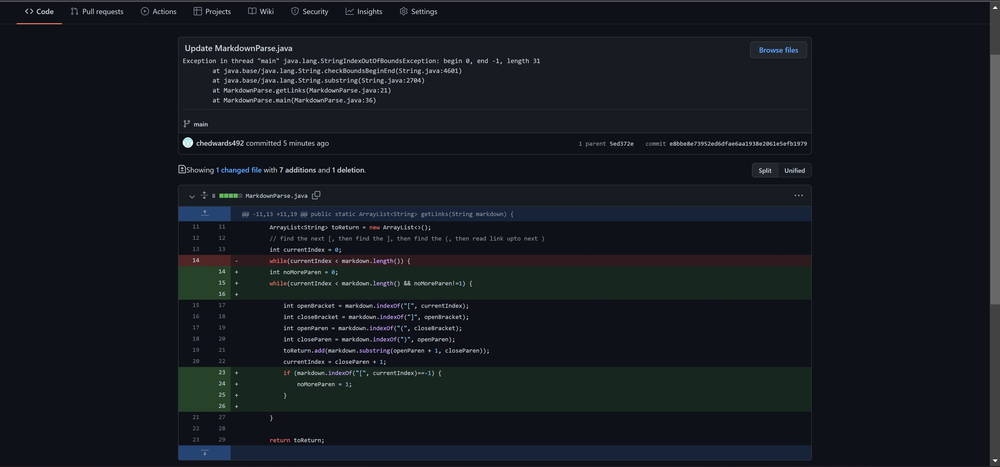
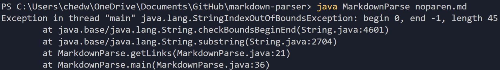

# **Lab Report 2: Debugging**

In programming, we often run into bugs that cause our program to fail. We must work in order to fix these bugs to get our program to funciton as it should. The most efficient way of doing this is called "Incremental Debugging". Below are the steps my team and I took in effort to make our program run as it should.

The program we started with is meant to search through a Markdown file and return the links contained in the file, in an ArrayList. A link, in Markdown, should be in the format `[Name of Link](TheLink.com)`

Initially, we ran the program on a markdown file with a link, but also with some empty space after the link. After studying the code and the test Markdown file that it was run on, we decided that the empty space after the link was causing the program to fail. After studying the code, my team fixed the issue by accouting for text or empty space at the end of the Markdown file. 

## The first code change

The image below shows the changes that were made to the original file in order to get the first test Markdown file to run.

We then created a new test to see if our program would act properly when met with a different Markdown file. This new test file that I made contained brackets, but no parentheses surrounding the link. The supposed link looked something like, `[Link Name]TheLink.com`

This caused an error message to appear in my terminal. Below is the following output that I received.

[link](C:\Users\chedw\OneDrive\Documents\GitHub\markdown-parser\test-file.md)

[linktryagain](../../../../../Documents/GitHub/markdown-parser/test-file.md)

# Title

[link1](https://something.com)
[link2](some-thing.html)

