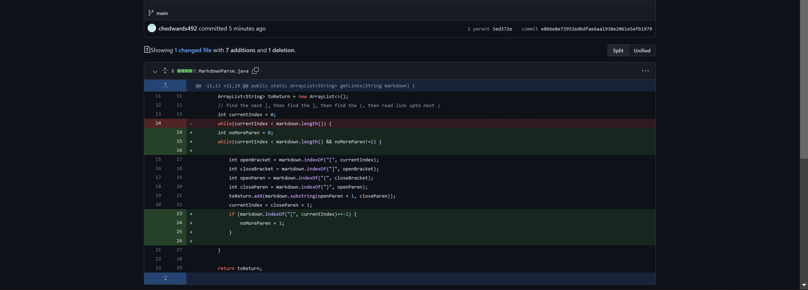

# **Lab Report 2: Debugging**

In programming, we often run into bugs that cause our program to fail. We must work in order to fix these bugs to get our program to funciton as it should. The most efficient way of doing this is called "Incremental Debugging". Below are the steps my team and I took in effort to make our program run as it should.

The program we started with is meant to search through a Markdown file and return the links contained in the file, in an ArrayList. A link, in Markdown, should be in the format `[Name of Link](TheLink.com)`

Initially, we ran the program on a markdown file with a link, but also with some empty space after the link. After studying the code and the test Markdown file that it was run on, we decided that the empty space after the link was causing the program to fail. After studying the code, my team fixed the issue by accouting for text or empty space at the end of the Markdown file. 

## The first code change

The image below shows the changes that were made to the original file in order to get the first test Markdown file to run.

The link below is the link to the Markdown test file that made the original program fail.

[test-file.md](test-file.md)

We then created a new test to see if our program would act properly when met with a different Markdown file. This new test file that I made contained brackets, but no parentheses surrounding the link. The supposed link looked something like, `[Link Name]TheLink.com`

This caused an error message to appear in my terminal. Below is the following output that I received.

As in the output, there were invalid indices passed into the substring method in line 21 of MarkdownParse.java. Because there were no parentheses in the test file, the variables openParam and closeParam were set to -1 (as returned by indexOf because no parentheses were found). Thus, the arguemnts of the substring method, openParam and closeParam, were 0 and -1, causing the IndexOutOfBoundsException to be thrown.

## The second code change

Below is a screenshot of the changes I made to the program is order to fix the previous bug.

Continuing with the incremental debugging strategy, I made a new test file that my program failed. This one had parentheses around the link url, but no brackets preceding it. It looked something like `Links(thelink.com)`. Below is the link to that test file.

[Parentheses with no brackets test](noBracketsYesParentheses.md)

Running my program on this test resulted in the following output.

This output message does not look like the previous one. My program did not fail the same way it did previously. Instead, it simply functioned wrong and produced the wrong result. The file I tested my program on did not contain any links of the proper format, so the program should have returned nothing (rather than `[something.html]`)

In effort to fix the previous symptom, I only accounted for a lack of parentheses, as that was why my program was not running properly. My program assumed that the `[Link]` part of the link format existed. So, regardless that there were no brackets included in the link, the text between the parentheses was included and returned in the ArrayList.

## The third code change

Below is the screenshot of the changes I made to my program to fix the previous incorrect output.

The next test that I created had both the brackets and parentheses of the link, but had some text between the brackets and parentheses. It looked like `[Link name]some text(TheLink.com)`.

[Text between Brackets and Parentheses Test](textBetweenBrAndPa.md)

Below is the output that resulted from running my program using this test file.

Similar to the previous bug, the output of this bug is not a fail message, but rather an incorrect output. Because there is text between the bracket and parentheses part of the Markdown link format, the text within the parentheses shouldn't have been returned as a link in the ArrayList.

The issue with my code is that it does not ensure that the closing bracket, "`]`", and the opening parenthesis, "`(`", have no space between them, as Markdown requires. My program only checked to ensure that there existed both brackets and parentheses, but did not account for the relative positions of the two.
