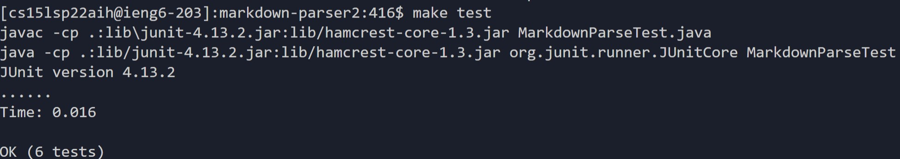

# **Lab Report 3**

## Group Choice 1
### Streamline ssh Configuration

**Firstly**, I created a new file under the directory `~\.ssh` called config. I would then add the lines below into this file using VScode as my editor. This file would cause SSH to recognize my username when trying to log into the school server, `ieng6.ucsd.edu`. Below is a screenshot showing the file `config` in the directory `~\.ssh\config` that I edited.

After I did this, I am now able to log in to the ieng6 server without having to include my username in the command. This is shown below, as the command was simply `ssh ieng6` and I was not prompted with a username or password. 

I then copied a file on my local computer, into my account on the server. I had a file called `noParen.md`, on local computer, and used scp to move it to a directory on the server computer on the account specific to me. However, now I didn't have to include my username, I was simply able to include the hostname, `ieng6` to copy it over. The screenshot below shows the `noParen.md` file in the server's directory.

## Group Choice 2
### Setup Github Access from ieng6

I added a SSH public key to my Github account, displayed below.

The matching private key is on my account on server, showed below.

In order to edit files on my repository from the server computer, I first logged into ieng6. I then ensured that I had the most up-to-date version of my repository using git pull. I then edited the file `somText.txt` using the `vim` command. This allowed me to edit the file on the server's terminal. After I made the changes, I used `git add` and added the file to the staging area. From there, I used `git commit` to commit the file. From there, I was finally able to push it to the origin using `git push`. Below shows my terminal after following those steps.

The file, `somText.txt`, was successfully pushed to the origin, the link to the changes is shown below.

[somText.txt change in github](https://github.com/chedwards492/cse15l-lab-reports/commit/2fd2ef82f7ecf4d61919a081e99e07dbf4e7e4f2)

## Group Choice 3
### Copy Whole Directories with `scp -r`

Here, I recursively copy the entire directory to a directory on the server computer using `scp -r`.

Then, in the server's terminal, I compile and run the JUnit tests for the markdown-parse repository.

Lastly, to make things faster, I can combine commands to copy the directory, like I did earlier, and run the tests all in one line.

