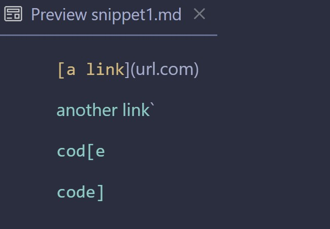
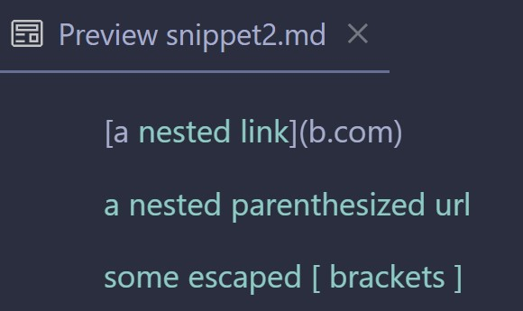
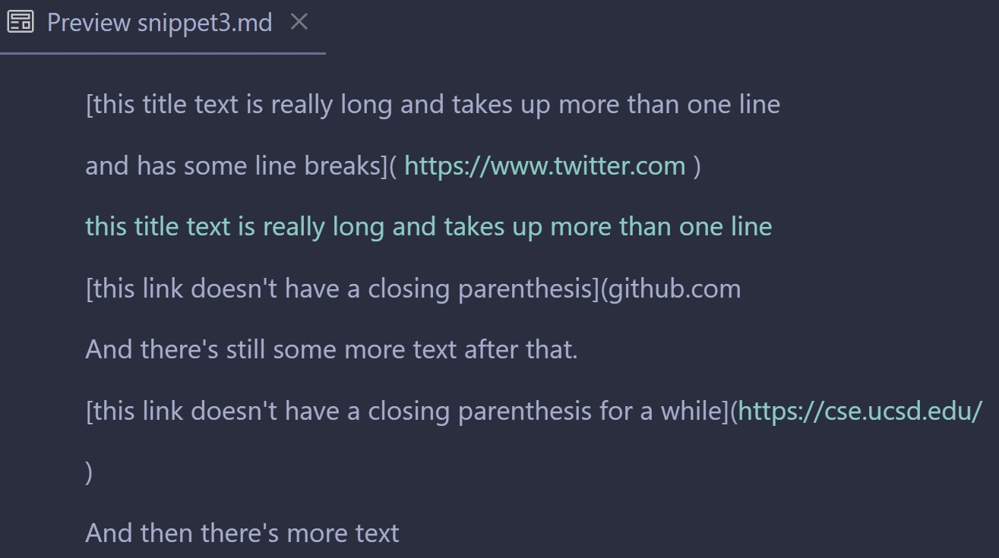
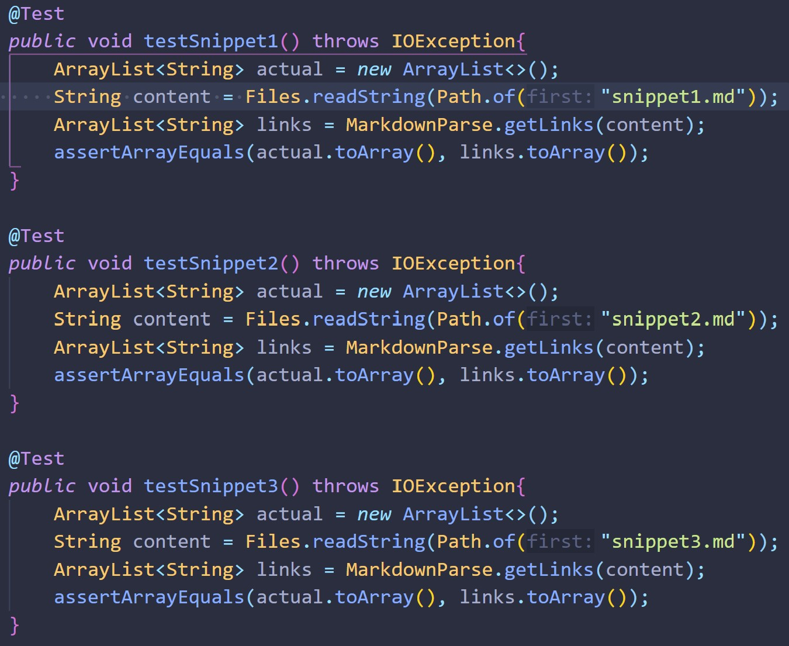
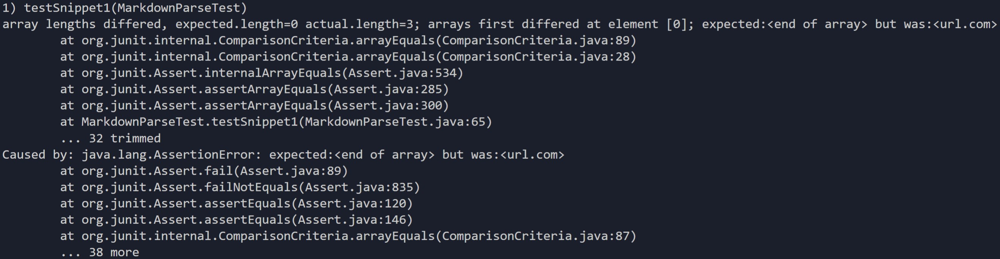
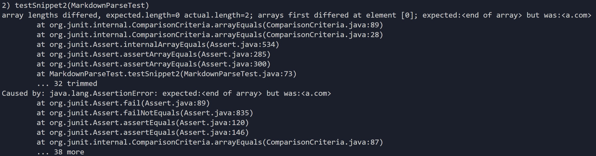
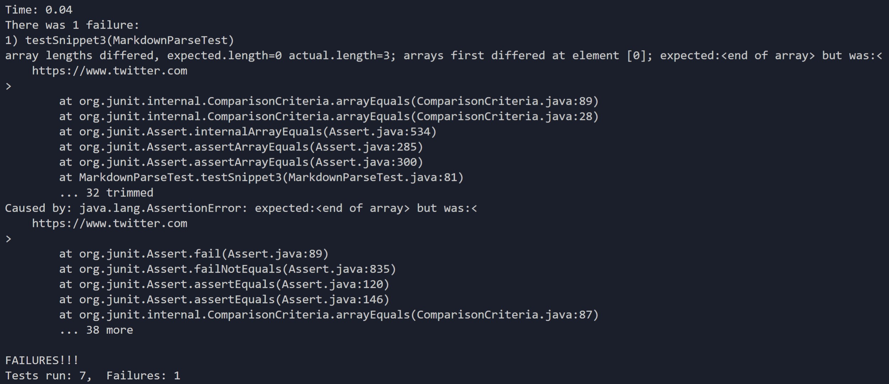
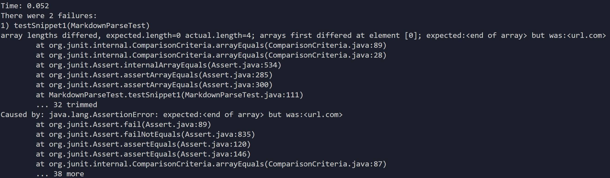
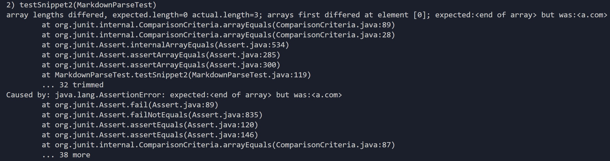

# Lab Report 4 Week 8

[Link to my repository](https://github.com/Sking56/markdown-parser)

[Link to Review Repository](https://github.com/mdsflyboy/markdown-parser)

The following screenshots are previews of the snippet markdown files that show what the output *should* look like. 

I added tests in `MarkdownParseTest.java` for each snippet markdown file.

The test I created for `snippet1.md` failed, the output is below.

The test I created for `snippet2.md` failed, the output is below.

The test I created for `snippet3.md` failed, the output is below.

For the repository that I reviewed:

The test I created in the reviewed repository for `snippet1.md` failed, the output is below.

The test I created in the reviewed repository for `snippet2.md` failed, the output is below.

The test I created in the reviewed repostory for `snippet3.md` passed.

### Snippet 1 Code Change

I believe that my program can be fixed with a small change so that the test for `snippet1` passes. I believe that simply accounting for the backticks will help my code to function. If the opening backtick is before the opening bracket of the link and closed after the opening bracket, I would disregard the link. Otherwise, I would include it as a link. This is in line with the preview, as the only instance that isn't a link is the one where the backtick is before opening bracket and closes after that bracket.

### Snippet 2 Code Change

I am not certain if this code change would be less than 10 lines. My program could be fixed by ensuring that the opening bracket of the link has a closing bracket to match it. With the parentheses of the link, I would ensure that the outermost opening parenthesis has a pair, and then ensure that all that is inside the outer parentheses pair is interpretted as the link. I would also write an if statement when finding the index of the brackets, if the brackets have a backslash before them, disregard them. This would be around 10 lines, it wouldn't be a small change but it also wouldn't be a large change.

### Snippet 3 Code Change

I would have check to see if there is a line break before the opening bracket or parenthesis is closed and act from there. I would also have to check to see if the text within the parentheses began with `https://` because any text with that at the beginning is seen as a link. The second change would fix most of the differences between Markdown's and my program's interpretation. 