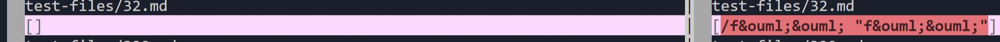
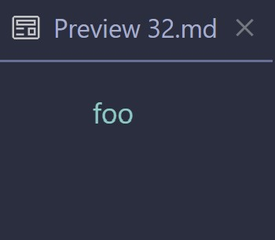
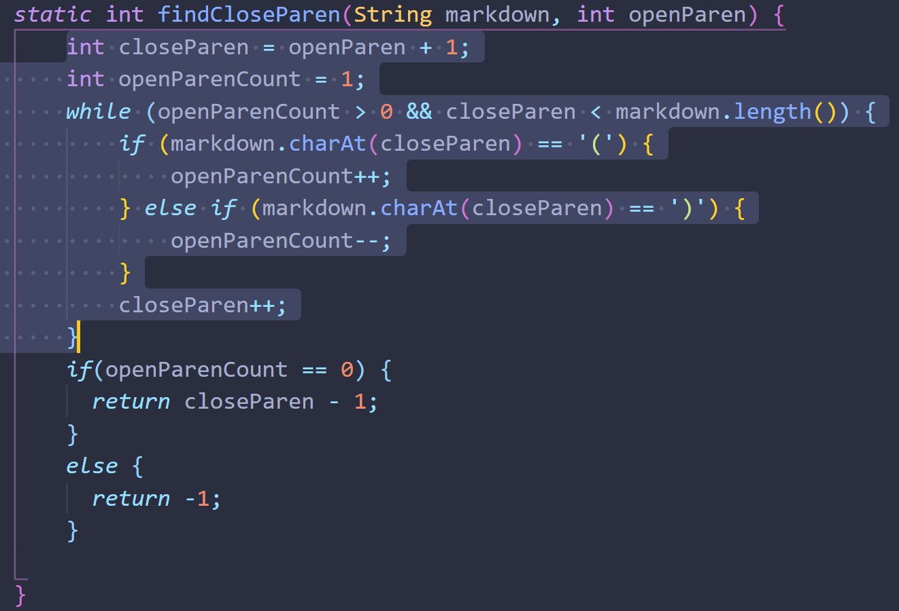
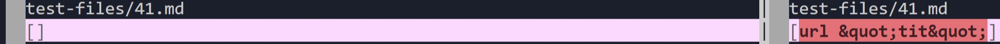
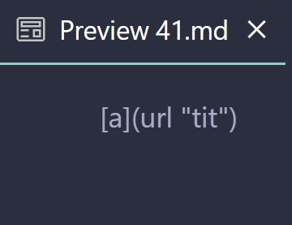
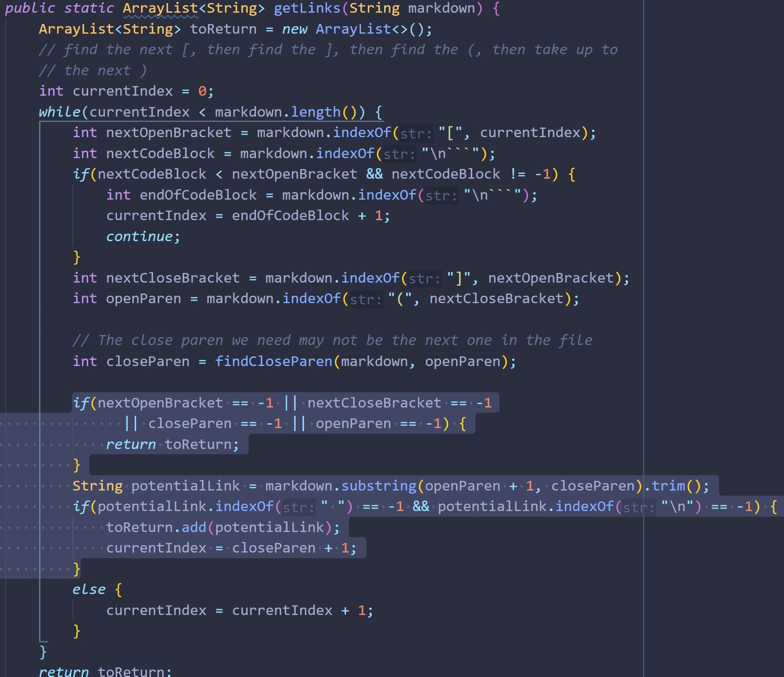

# Lab Report 5 Week 10

I found the differences in test results using command `vimdiff` and a separate file containing the output of `bash script.sh`. I first copied the output of each run of `bash script.sh` into a file called `results.txt` in the respective directories. I then used `vimdiff` to compare these two files and highlight the differences.

[Test 32](32.md)

[Test 41](41.md)

## Test 32

Both my implementation and the given implementation failed this test. The given implementation (on the left) found no links, while my implementation provided, in the link, text that was not part of the link.

### Expected output

The expected output for Test 32 is below. It expects a link named `foo` with url `/f&ouml;&ouml;`. The output should be `[/f&ouml;&ouml;]`

### Fixing my program

The expected output against the actual output of my implementation differs in that mine disregards spaces in the link and includes everything. The expected output does not include any text in the link after the space, whereas mine includes the `"f&ouml;&ouml;"` after the space.

My implementation of the `findCloseParen()` method does not account for spaces between the url's parentheses. It instead includes everything inbetween the parentheses. Accounting for spaces within this method will fix this issue.

## Test 41

The given implementation gives the correct output: no links found. My implementaiton gives the incorrect output: `[url &quot;tit7quot;]`. My program sees anything between parentheses as a url. It should recognize that the space between and the lack of quotation marks means that it should not be regarded as a url.

### Expected output

The expected output for Test 41 is below. It expects no links, but rather just the text "`[a](url "tit")`". The output should be just `[]`.

### Fixing my program

The issue with my implementation is that the method `getLinks()` does not check for quotation marks in the case that there is a space in between the parentheses. It should check if there is a space, and if there is, check if there are quotations around the rest of the text and determine if it's a proper url according to that.

Below is the code in which I would implement this change.

