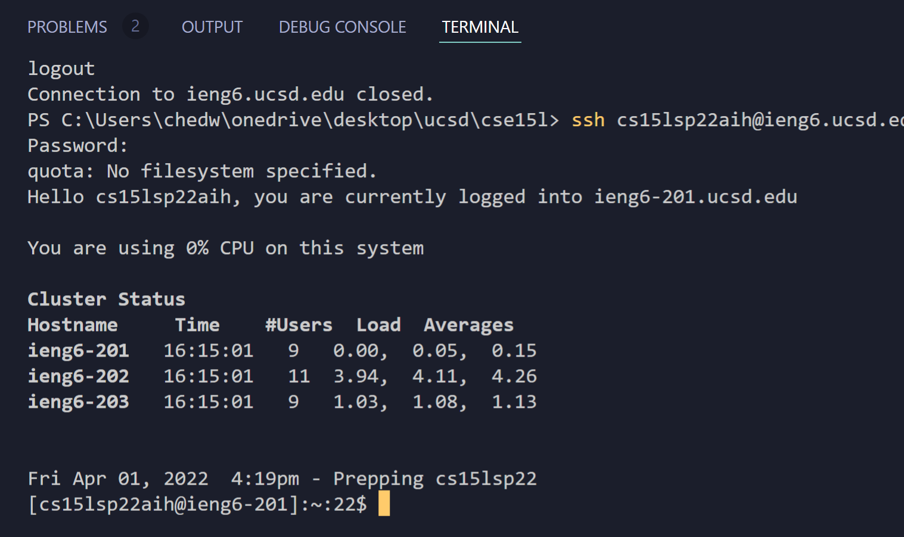
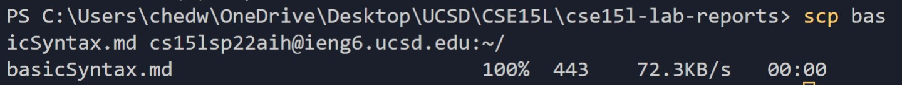
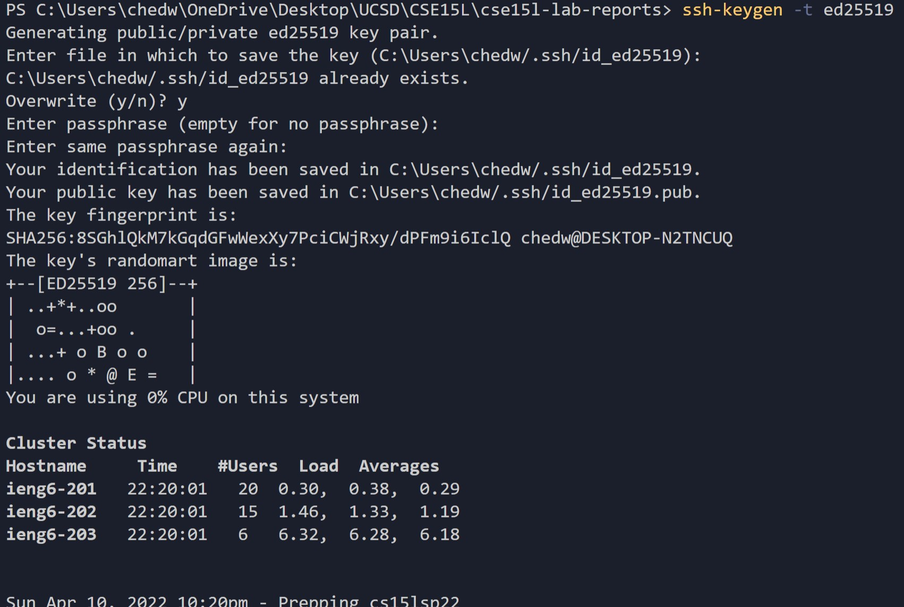
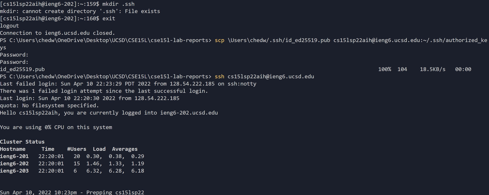
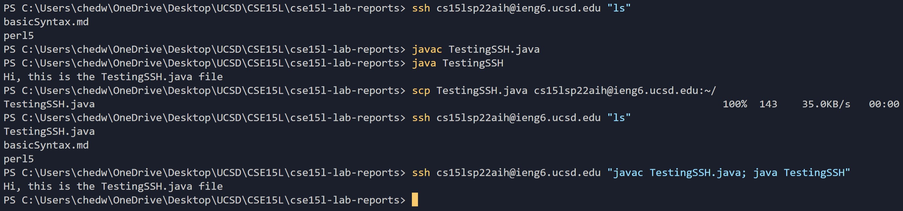

# **CSE15L Weeks 1-2 Tutorial**

## **This tutorial will cover**
* Installing VScode
* Remotely Connecting
* Trying some Commands
* Moving files with `scp`
* Setting an SSH Key
* Optimizing Remote Running

## **Installing VScode**
Navigate to the website below and follow the instructions to install VScode onto your computer

[VScode Installation](https://code.visualstudio.com/)

Once you have installed VScode

## **Remotely Connecting to Server**

**Step 1:**
Access your course-specific CSE15L account at the following link:
[Access CSE15L Account](https://sdacs.ucsd.edu/~icc/index.php)

**Step 2:**
Open your terminal using Ctrl+Shift+` or Terminal -> New Terminal from the menu

In your terminal, enter $ `ssh cs15lsp22zz@ieng6.ucsd.edu` (except with the correct user in place of `zz`)

If prompted with: `The authenticity of host 'ieng6.ucsd.edu (128.54.70.227)' can't be established.
RSA key fingerprint is SHA256:ksruYwhnYH+sySHnHAtLUHngrPEyZTDl/1x99wUQcec.
Are you sure you want to continue connecting (yes/no/)?` enter yes (y) to these messages.

You will then be prompted with `Password:` at which you will enter your password (or copy and paste it)

You won't be able to see the text as you are typing or pasting your password in, but press enter regardless.

If all goes well, you should see, in the terminal, something like:
PUT IMAGE HERE FOR TERMINAL OUTPUT WHEN LOGGING IN

You are now connected to a computer in the CSE basement. All commands you run in this terminal, while connected, will run on the remote computer. *Your* computer, the one you are physically typing on, is referred to as the *client* and the computer in the basement that you are connected to is referred to as the *server*, or *remote computer*.

Your terminal should look like this:

Remember that you can always log out of the remote server in your terminal by using
* Ctrl-D
* Enter `exit` into the terminal

## **Trying Some Commands**

We can try running a few commands in the server's terminal:

* `cd ~` - changes the current directory to the root directory
* `cd <some_directory>` - changes the current directory to `<some_directory>` (whatever your input is)
* `ls` - lists the files within the current directory
* `ls -l` - lists files as well as the permissions for the files
* `ls -a` - lists *all* files (including hidden ones)
* `ls -lat` - combines all ls commands and returns each output
* `ls <some_directory>` - performs ls on `<some_directory>` without changing the current directory to that directory
* `echo "this is text" > <some_file>` - creates a file, `<some_file>`, and adds `"this is text"` to it
* `cp <some_file> <destination_file>` - copies `<some_file>` into `<destination_file>` 
* `cat <some_file>` - prints the contens of `<some_file>`

The following image depicts some examples of running these commands:

1. We checked what files are available to us in the current directory using `ls`
2. We used `cd` to change to a directory that we found from the previous step
3. We used `ls` to see what files are contained in the current directory
4. We created a new file `hello.txt` and put the contents `"hello everybody"` into it and checked to see that the file was created
5. We copied the file that we just made into `hey.txt` that we created by using `cp` and check to verify the `hey.txt` file was created
6. We printed out the contents of `hello.txt` and `hey.txt` using `cat`

## **Moving Files With** `scp`

We can move files from the *client*, our computer, to the *server*, the remote computer.

We do this by using the `scp` command from our client's terminal.
The syntax is:
`scp <file_to_move> cs15lsp22zz@ieng6.ucsd.edu:~/` where `file_to_move` is the file in the client that you wish to move to the server computer.

If we follow the steps properly, the client terminal should return something that looks like this:

In this example, we copied the file, `basicSyntax.md`, over to the remote computer. The terminal confirms this through the `100%` that it returns, letting us know that the command was successfully executed.

## **Setting an SSH Key**

As we work with remote servers, we notice that we have to enter our password quite often. Having to enter the password repeatedly is annoying and inefficient. Luckily, there is something we can do so that the server knows to trust our computer, but does not require a password input from us.

The solution is something called "`ssh` keys". The basic idea of `ssh` keys is to create a pair of files, one *public key* and one *private key*. We copy the public key to a location on the server computer and copy the private key somewhere on the client, our computer.

**Firstly**

In the client's terminal, enter the command `$ ssh-keygen`

For those using Windows OS, enter the command `$ ssh-keygen -t ed25519` instead.

You will then be prompted with a few questions. You will be asked where you want to save the key; you should just use the default directory (press enter to simply use the directory that is included when you are prompted).

You will then be asked to enter a passphrase. In order to make things easiest and so that you don't have to enter a password everytime you want to access the server computer, just press enter for no passphrase. Your terminal should look like the following after you follow these steps:

** Those on other OS than Windows should notice that the output after these steps is slightly different. If you are not using Windows, you might see `id_rsa` in the directories mentioned in the output rather than `id_ed25519`.
Rsa and ed25519 are both keys, they work in virtually the same ways, only that ed25519 works on Windows and rsa works on other operating systems.

** Disregard the lines that say                      
`C:\Users\chedw\.ssh\id_rsa already exists.`           
`Overwrite (y/n)? y`                          
This is here because I had already created the key and am recreating it for this tutorial.

Now we have created the public and private keys in the .ssh directory on the client. Our next step is to copy the public key to the .ssh directory on our account on the server computer.

We can do this by first logging into the remote computer through the command we usually use: `$ ssh cs15lsp22zz@ieng6.ucsd.edu`   
You will be prmompted to enter you password, as we have not quite completed the keygen process.
Once on the remote computer, enter the command `$ mkdir .ssh`  
After this, logout of the remote computer (enter command `$ exit`).

In the client terminal, enter `$ scp /Users/<user-name>/.ssh/id_rsa.pub cs15lsp22zz@ieng6.ucsd.edu:~/.ssh/authorized_keys`    
Except, use the directory that you saved the key in from the first step. Also, use you user name in place the `zz` user. Windows users' directory should end in `id_ed25519.pub` rather than `id_rsa.pub`.

Your terminal should look like this once you've completed all the above steps.

Congratulations! You are now able to access the remote computer without having to enter your password. Try it: enter the usual `$ ssh cs15lsp22zz@ieng6.ucsd.edu` and you should be logged in without being prompted to enter you password.

## **Optimizing Remote Running**

Now that we are somewhat familiar with the some command line commands, `ssh`, and accessing remote computers, let's try to make these more efficient.

Take a look at a screenshot of my terminal after running some commands, both in the client and on the remote server.

**Accessing the server without logging into the server**

You might notice that the entire time, I'm working in the client's terminal. However, I am also accessing the remote computer.
Because we set up the public and private keys, we can access the remote computer without having to log in everytime. 

The formula for doing this is `ssh cs15lsp22zz@ieng6.ucsd.edu "<some_command>"`

The first command in the image above, I ran `ls` on the remote server. It returned the `basicSyntax.md` that we copied to the server earlier, as well as `perl5` that was on the server to begin with.

Next, on the client, I compiled and ran a Java file that I made called `TestingSSH.java`. The class in this file, `TestingSSH`, simply prints out the message `"Hi, this is the TestingSSH.java file"`.

I then copied this file over to the server using `scp` that we learned previously. The returned statement shows that the copy was successful. I verified that this file arrived to the remote directory using `ssh cs15lsp22zz@ieng6.ucsd.edu "ls"`, which showed us that `TestingSSH.java` had been added as a file in this directory.

All the commands that we had previously covered can be run on the remote computer, using this method, just like `ls` was in this example.

**Running multiple commands on one line**

I then used an efficient trick available to us: I ran multiple commands on one line. This can be accomplished by separating each command with a semi-colon, ";".

We are still in the client's terminal, but I accessed the server's terminal using the first part, `ssh cs15lsp22zz@ieng6.ucsd.edu`, and then ran the commands I wanted by putting them in quotation marks. I wanted to compile the `TestingSSH.java` class that we had just sent to the server, and run it on the server. This was accomplished through `"javac TestingSSH.java; java TestingSSH"`.

The server then ran the `TestingSSH` class and returned the output in the terminal.    
Success! We have now sent a file that we made locally over to the server, compiled it, and ran it without ever having to log into the server. This was much more efficient than what we had previously been doing

**Quick Tip**

We can use the up and down arrows on the keyboard to recall the recent commands that were run. The up arrow will copy the previous command into your terminal so you don't have to type it all out repeatedly. You can cycle through past commands using the up and down arrows to make your work more efficient.

## **Summary**

There are countless ways to become more efficient when working with remote servers, play with the terminal and see how you can optimize your work even more. Good luck!
